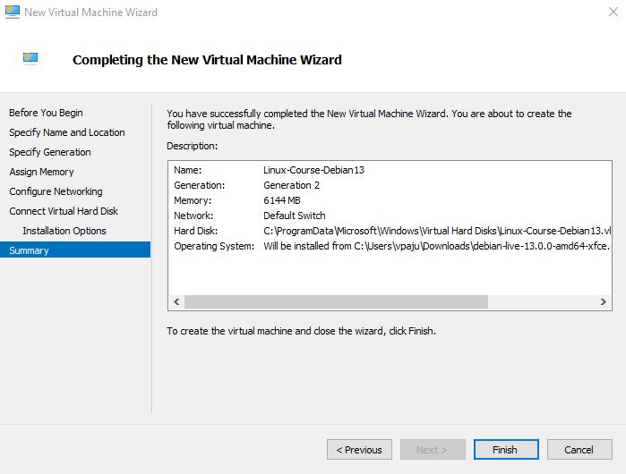
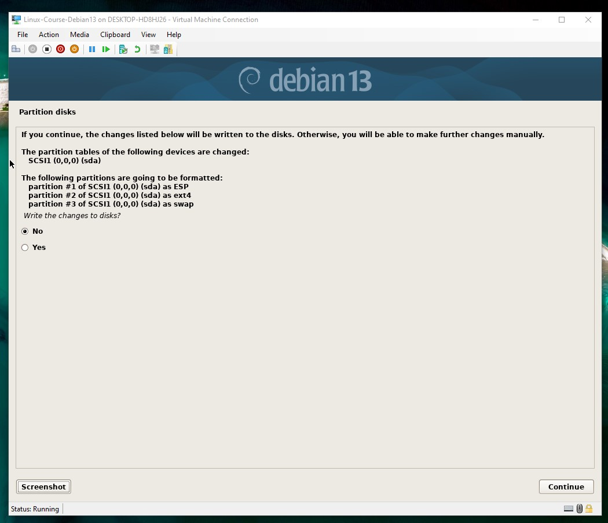

# x) 
-Raportoi täsmällisesti samalla kun teet. Kerro missä teit(ympäristö), mitä teit (poimi ylös ajetut komennot yms oleelliset tiedot) ja käytä väliotsikoita.

-Muista lähteet ja viittaukset

-Käytä GPL lisenssiä.

# a)

## Debian13 asennus

Tässä raportissa asennetaan debian13 virtuaalikone käyttäen hyper-v virtualisointi softaa.
valitsin debian-live-13.0.0-amd64-xfce.iso imagen. 

Käyttöjärjestelmän versio Debian 64bit, muistia 6144mb, prosessoreita 12, harddrive space 20gb.

Seuraavaks valitsin graafisen asennusvaihtoehdon ja valitsin oikeat timezonet, näppäimistöt ja utf8 encooderin. Debian installer jakaa kovalevyn kolmeen osaan jos valitsee ns default suositellut vaihtoehdot installer putkesta. 

ESP=UEFI firmware boot operating systems. Store bootloaders like GRUB.

ext4=default linux filesystem. Täällä se itse osa oleilee. Mountpoint "/"

Swap=käyttää kovalevytilaa virtuaalisena muistina jos rammi loppuu kesken.

Asennus kesti varmaan tunnin johtuikohan matalasta prosessorien määrästä. Eli asennusvaiheeseen suosittelisin laittaan maksimi määrän. Deskarille asennus oli ainaki nopeempi neljällä. Vaikkakin ite host koneen cpu oli vahvempi. Kolmannelle kerralle laitoin 12 prosessoria, 6gt rammia ja asennusprosessi nopeutui huomattavasti.

# b)

Lähteet: 
Debian graphical installer
chatgpt.com
kuvien lähde: Debian13

