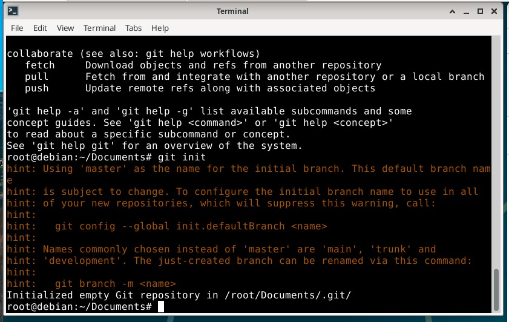
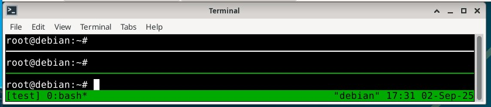
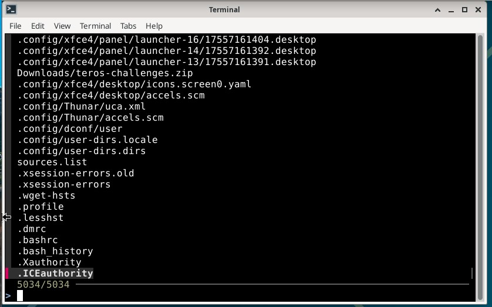
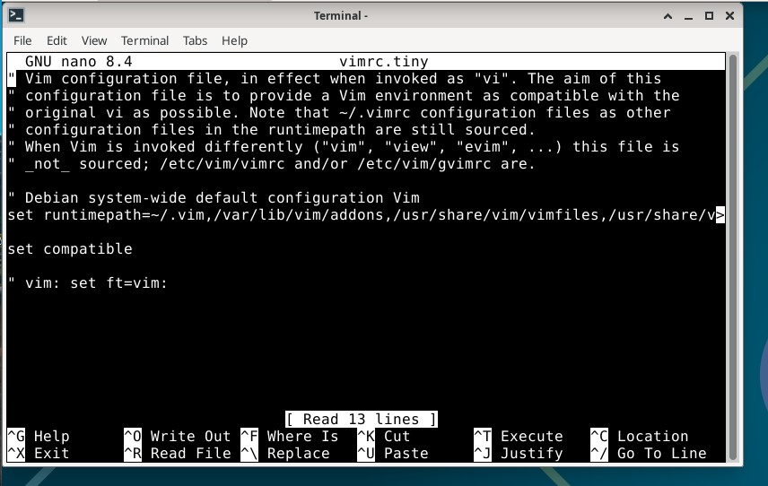
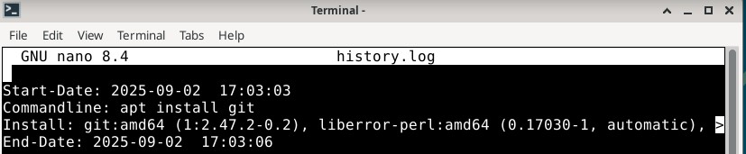
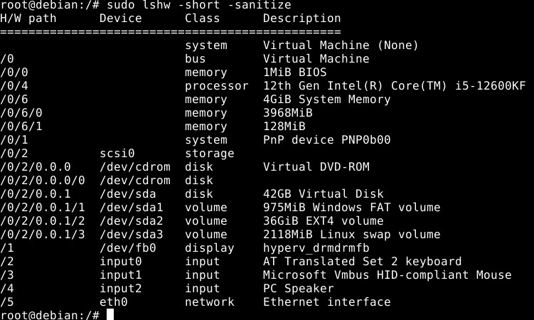

## x)

-Linuxin ja BSD komentorivi on ollut jo olemassa jo ennen internettiä. Sitä voisi kuvailla nopeaksi ja
helpoksi automatisoida.

-Komentorivillä navigointiin tarvitsee: pwd, ls, cd root/, cd ..
kokeilemalla selviää mitä kukin tekee.

-Tabulaattoria kahesti painamalla näyttää komentorivi mitä kaikkee voit kirjoittaa seuraavaksi.
se myös täydentää komentoja joka vähentää kirjoittamista.

-Filesystem kaikissa linuxeissa koostuu samalla tavalla hakemistoista: 
/home/user/, /etc/, /media/, /var/log/

-Sudo komennon eteen jos teet järjestelmätason komentoja/päivityksiä.

## a)

-ajoin: sudo apt install micro
"micro is already the newest version (2.0.14-1+b6)

## b)

git

tmux

fzf

### "sudo apt install git tmux fzf"

Tästä komennosta ainakin tuli takasi vastaus joka ilmaisi kaikkien pakettien olevan jo asennettu.

## c)

### /home/user/, /etc/, /media/, /var/log/

root käyttäjällä /home/user/ on sama kuin "~#" kansio.
eli kansio mihin terminaali heti aluksi käynnistyy.

komennolla "cat Desktop" saadaan aikaiseksi kuvaava selitys joka
ilmaisee että Desktop: Is a directory.

komento cd .. päästään roottiin. cd etc päästään etc kansioon. 
ls, cd vim ja nano vimrc.tiny. Kyseessä siis vim tekstieditorin configuraatio file.

Media kansiossa on 2 tyhjää kansiota nimeltä cdrom ja cdrom0. Niiden
tarkoitus on liittää ulkoiset tallennuslaitteet käyttikseen.

cd var, cd log, cd apt, ls, nano history.log
Eli tästä osoitteesta /var/log/ löytyy yleisesti järjestelmän loki tiedostoja. apt kansiosta löytyy asennetut ohjelmat.

## d)

Esimerkiksi etsiä jostakin tietystä logista errorit. Tää onnistuu komennolla:

### "grep -r "error" /var/log"

Useampi etsittävä sana yhdessä komennossa.

### "grep –e "Agarwal" –e "Aggarwal" –e "Agrawal" geekfile.txt"

Montako kertaa sana "unix" esiintyy alla olevassa filessa.

### "grep -c "unix" geekfile.txt"

## e)

### "$ ls -l | find ./ -type f -name "*.txt" -exec grep "program" {} \;"

Tää komento etsii .txt fileista tekstiä "program" siitä kansiosta missä komennon ajo hetkellä oltiin.

## f)

Kyseisestä kuvasta näkyy ajossa ollut komento ja tulokset. Tuloksista voi lukea, että kyseessä on virtualisoitu ympäristö ja host koneessa on käytössä intelin rautaa. Kuvasta näkee myös levyn osuudet ja ram muistin määrät. En todellakaan tajua mitä tästä pitäis tän enempää analysoida kuvahan on vain lista asioista joita koneessani on.

Lähteet:
https://dev.to/lissy93/cli-tools-you-cant-live-without-57f6
https://www.linuxlinks.com/100-great-must-have-cli-linux-applications/
https://www.geeksforgeeks.org/linux-unix/piping-in-unix-or-linux/
chatgpt.com (tyhmille kysymyksille)

